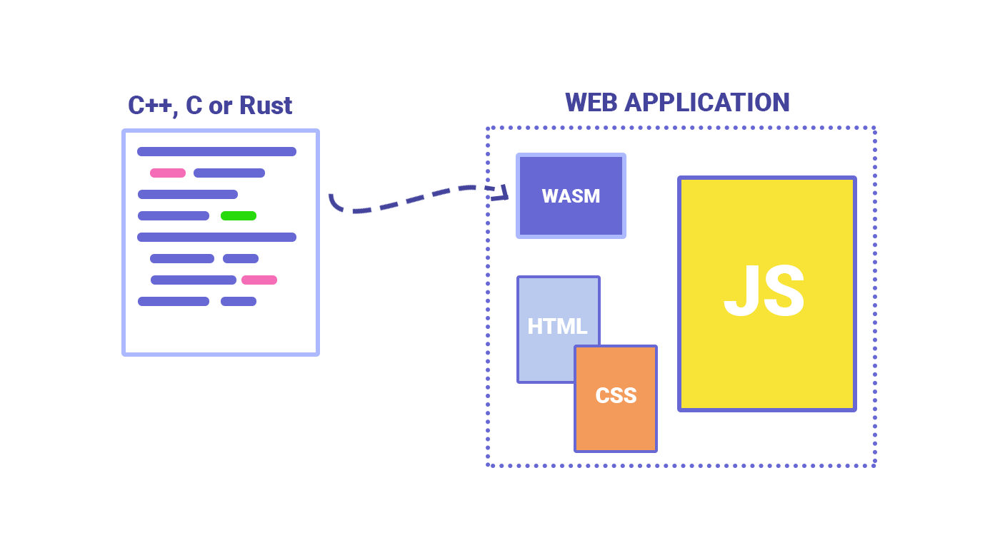

# WebAssembly

## Table of Contents
- [Gaming](#want-to-play-a-game-during-the-presentation)
- [Description](#what-is-webassembly)
- [Pipeline](#how-it-works)
- [Perspective](#perspective-from-web-application)

## Want to Play a Game During The Presentation?
- Explore a 3D space station and fight robots: https://beta.unity3d.com/jonas/AngryBots/
- Arena Shooter (very doom-isk): https://kripken.github.io/misc-js-benchmarks/banana/index.html

## What is WebAssembly?
WebAssembly (abbreviated Wasm) is a binary instruction format for a stack-based virtual machine. Wasm is designed as a portable compilation target for programming languages, enabling deployment on the web for client and server applications. A good starting place is https://webassembly.org/ to gather more information.

## How it works
WebAssembly is not quite an assembly language, its tool made for the browser. It acts as more of a virtual machine similar to Java Virtual Machine and the Python Virtual Machine but has multi-language support.

### .wat & .wasm


## Perspective From Web Application
WebAssembly goal is not to replace JavaScript, but to relieve computationally heavy tasks to faster and less error prone languages. Due to this, load times and possible 3D rendering tasks aren't regulated by the slow speed of JavaScript.




## Pros of WebAssembly
- **Multiple Language support** WebAssembly enables compiled languages such as C, C++, Rust, and Go to run natively in the browser, providing developers an alternative to JavaScript for building high-performance web applications.
  - Framework:
    - [Yew](https://yew.rs/)
      - Yew code:
      ```rust
            fn my_functional_component() -> Html {
              let (count, set_count) = useState(|| 0); // Initialize count to 0

              html! {
                <div>
                      <h1>{"Hello, World!"}</h1>
                      <p>{"This is a functional component in Yew."}</p>
                      <p>{"Count: "}{count}</p>
                      <button onclick={move |_| set_count(count + 1)}>{"Increment"}</button>
                  </div>
                }
            }
      ```
      
      - React code:
    ```javascript
      const MyReactComponent = () => {
      const [count, setCount] = useState(0); // Initialize count to 0

      return (
          <div>
            <h1>Hello, World!</h1>
            <p>This is a functional component in React.</p>
            <p>Count: {count}</p>
            <button onClick={() => setCount(count + 1)}>Increment</button>
          </div>
         );
      };
    ```
  - Toolkit
    - [AssemblyScript](https://www.assemblyscript.org/)
    - [wasm-pack](https://rustwasm.github.io/docs/wasm-pack/)
    - [Emscripten](https://emscripten.org/docs/introducing_emscripten/index.html)

- **Faster, Efficient and Portable** WebAssembly binary files are smaller than JavaScript files, leading to faster loading times and execution speeds, which can improve the performance of web applications.

- **Easy to understand and debug** − WebAssembly enables developers to compile code from other languages into a binary format that can be executed in the browser, providing a simple alternative to writing WebAssembly code, while also supporting a text format for debugging and editing 


- **Security** WebAssembly prioritizes security by isolating module execution in a sandboxed environment, enforcing browser security policies, and supporting developers to create secure applications.


## Cons of WebAssembly
- **security issue** it is possible that security issues may arise, making it simpler for criminals to conceal malware, phishing attacks, and other malicious activities

- **DOM manipulation** WebAssembly is not yet capable of interacting with the Document Object Model (DOM) and it still relies on JavaScript for DOM manipulation.
  
- **garbage collection** WebAssembly lacks garbage collection for automatic memory management.

## Benchmarks
- **Benchmark Sites:**
  - [Synthetic Benchmarks](https://takahirox.github.io/WebAssembly-benchmark/)
  - [PSPDFKit WASM](https://pspdfkit.com/webassembly-benchmark/)
  - [PSPDFKit Javascript](https://pspdfkit.com/webassembly-benchmark/?disableWebAssembly=true)
  - [Animation Demo](http://aws-website-webassemblyskeletalanimation-ffaza.s3-website-us-east-1.amazonaws.com/)
  
- **Results:**
<details>
<summary>Synthetic Benchmarks Fib</summary>


</details>
  
<details>
<summary>Synthetic Benchmarks Sort</summary>


</details>

<details>
<summary>Synthetic Benchmarks Grayscale</summary>


</details>

<details>
<summary>PSPDFKit WASM</summary>


</details>

<details>
<summary>PSPDFKit Javascript</summary>


</details>


## What has been done with WebAssembly?

- Many companies have incorporated it into their development processes since its conception

### Use Cases

- The main use cases put forward by the official WebAssembly collective
    - Graphically intensive games  **(Unity - WebGL)**
    - Image/video editing  (**Adobe Photoshop)**
    - Image recognition, VR, and augmented reality  **(Google Earth)**
    - CAD applications  **(AutoCAD)**
    - etc.

### Unity - WebGL

- Unity’s WebGL build option allows you to build Unity games that can run in the browser
- WebGL switched to using the Emscripten toolchain to cross compile Unity’s C/C++ runtime code to WebAssembly
- They concluded that, “WebAssembly is **faster**, **smaller**, and more **memory-efficient** than asm.js, which are all pain points of the Unity WebGL export.”

<p align="center">
  
</p>

source: [https://blog.unity.com/technology/webassembly-is-here](https://blog.unity.com/technology/webassembly-is-here)

### AutoCAD

- One year after WebAssembly’s initial launch, the AutoCAD team was able to run their 35 year-old C/C++ codebase natively as a web app using WebAssembly (Emscripten)
- This was a major step for WebAssembly since it demonstrated that large computationally intensive programs could be easily ported to the web
- Some have speculated that WebAssembly might lead to the end of traditional desktop applications

<p align="center">
  
</p>

source: [https://web.autocad.com/loginhttps://web.autocad.com/282b34e2128a1bd1ee1b7f23e8792740.png](https://web.autocad.com/282b34e2128a1bd1ee1b7f23e8792740.png)

### Figma

- A more modern example of WebAssembly improving tech actually comes from the new and popular design tool Figma
- Figma uses react.js for its outer UI and a high performance C++ codebase for the actual document editing tool
- Using WebAssembly, they were able to cut load time of documents by 3x

<p align="center">
  
</p>

source: [https://www.figma.com/blog/webassembly-cut-figmas-load-time-by-3x/](https://www.figma.com/blog/webassembly-cut-figmas-load-time-by-3x/)

## Conclusion

- WebAssembly is meant to augment JavaScript, not replace it
- It’s intended goal is to run web applications at near-native performance in the browser
- It could lead to Desktop apps becoming easier to access through the web
