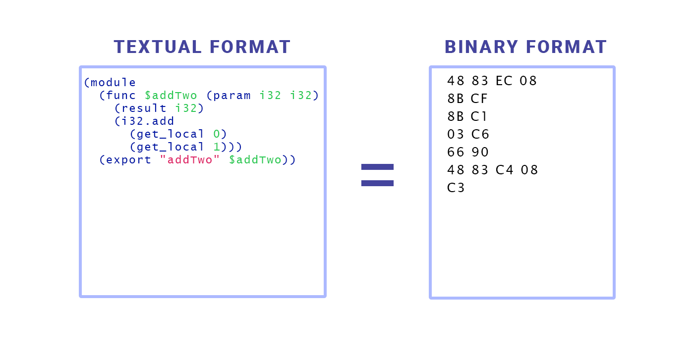

# WebAssembly

## Table of Contents
- [Gaming](#want-to-play-a-game-during-the-presentation)
- [Description](#what-is-webassembly)
- [Pipeline](#how-it-works)
- [Perspective](#perspective-from-web-application)

## Want to Play a Game During The Presentation?
- Explore a 3D space station and fight robots: https://beta.unity3d.com/jonas/AngryBots/
- Arena Shooter (very doom-isk): https://kripken.github.io/misc-js-benchmarks/banana/index.html

## What is WebAssembly?
WebAssembly (abbreviated Wasm) is a binary instruction format for a stack-based virtual machine. Wasm is designed as a portable compilation target for programming languages, enabling deployment on the web for client and server applications. A good starting place is https://webassembly.org/ to gather more information.

## How it works
WebAssembly is not quite an assembly language, its tool made for the browser. It acts as more of a virtual machine similar to Java Virtual Machine and the Python Virtual Machine but has multi-language support.

### .wat & .wasm

## Perspective From Web Application
WebAssembly goal is not to replace JavaScript, but to relieve computationally heavy tasks to faster and less error prone languages. Due to this, load times and possible 3D rendering tasks aren't regulated by the slow speed of JavaScript.

## Pros of WebAssembly
- **Multiple Language support** WebAssembly enables compiled languages such as C, C++, Rust, and Go to run natively in the browser, providing developers an alternative to JavaScript for building high-performance web applications.
  - [Yew](https://yew.rs/)
  - [AssemblyScript](https://www.assemblyscript.org/)
  - [wasm-pack](https://rustwasm.github.io/docs/wasm-pack/)
  - [Emscripten](https://emscripten.org/docs/introducing_emscripten/index.html)

- **Faster, Efficient and Portable** WebAssembly binary files are smaller than JavaScript files, leading to faster loading times and execution speeds, which can improve the performance of web applications.

- **Easy to understand and debug** − WebAssembly enables developers to compile code from other languages into a binary format that can be executed in the browser, providing a simple alternative to writing WebAssembly code, while also supporting a text format for debugging and editing 

- **Security** WebAssembly prioritizes security by isolating module execution in a sandboxed environment, enforcing browser security policies, and supporting developers to create secure applications.

## Cons of WebAssembly
- **security issue** it is possible that security issues may arise, making it simpler for criminals to conceal malware, phishing attacks, and other malicious activities

- **DOM manipulation** WebAssembly is not yet capable of interacting with the Document Object Model (DOM) and it still relies on JavaScript for DOM manipulation.
  
- **garbage collection** WebAssembly lacks garbage collection for automatic memory management.
